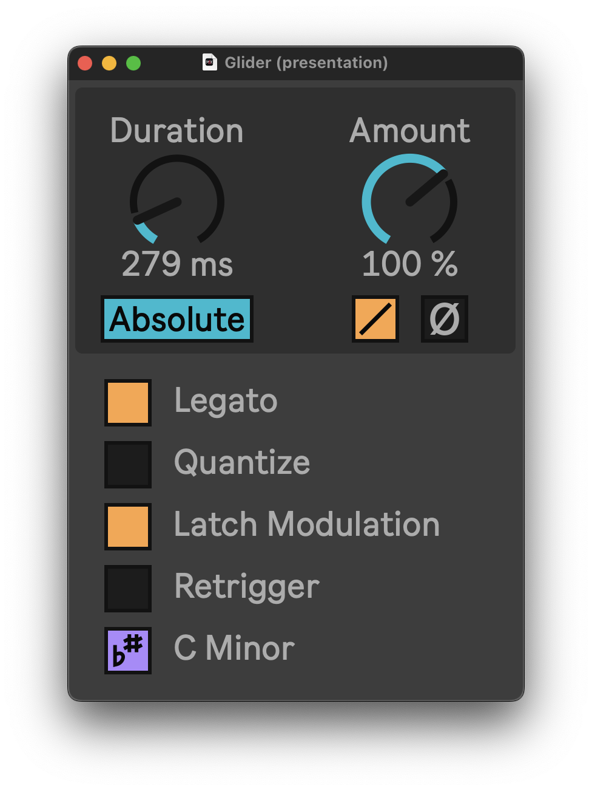

# Glider

Flexible MPE portamento effect for Ableton Live 12.



Glider generates MPE pitch bend automations that mimic various pitch effects:
- portamento, glissando, legato playing
- analog oscillator drift, extreme detuning, chords mutation
- arpeggios, resonators, note delays
- and much more — imagination is your limit, Glider rewards exploration and messing around.

Additionally, you can chain multiple Gliders together for infinitely complex effects and interactions.

## Setup

```shell
git clone --recursive https://github.com/pema4/lerpmusic-glider
```

Additionally you can install dev tooling:
```shell
git config --local diff.maxpat.textconv "python3 maxdevtools/maxdiff/maxpat_textconv.py"
git config --local diff.amxd.textconv "python3 maxdevtools/maxdiff/amxd_textconv.py"
git config --local diff.amxd.binary true
git config --local diff.als.textconv "python3 maxdevtools/maxdiff/als_textconv.py"
git config --local diff.als.binary true
```

Currently, Glider requires Max 9 to run.

## Architecture

There are 15 per-voice pitch-bend envelopes and one global envelope.

The global envelope follows the pitch of the last pressed note (incoming note-on messages form a stack). The target of this envelope is updated on every note-on and note-off MIDI message.

Each per-voice envelope starts when the device receives a note-on message. This envelope begins from the pitch value of the global envelope and converges to zero over a specified duration.

Glider is designed for combining and chaining. In this case, a naive implementation using the standard Max line object results in O(N^2) time complexity (where N is the number of chained Glider devices). To overcome this, we implemented a custom demand-rate variant of the line object. When the rate of incoming pitch-bend messages is high enough, the internal metronome turns off.

## Timing

Processing is synchronous: glide is computed and emitted in the same event as the incoming MIDI message (note on/off and pitch bend). Theoretically, this means the generated pitch bend is consistent even for short notes.
